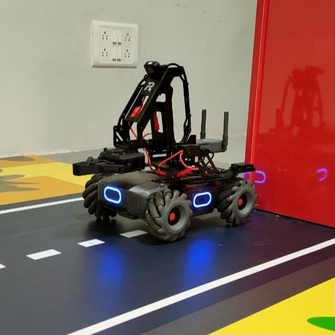
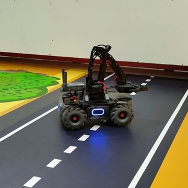
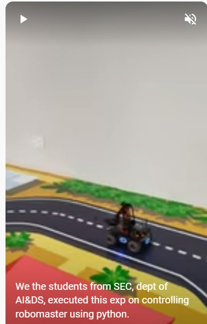

# MobileRobot-Openloopcontrol
## Aim:

To develop a python control code to move the mobilerobot along the predefined path.

## Equipments Required:
1. RoboMaster EP core
2. Python 3.7

## Procedure

Step1:
Import robot from robomaster start the project.

Step2:
Import time.

step3:
Adjust the x, y and z axis to adjust the movement of the robot.

Step4:
Adjust the movement of the robot to move in circles.

Step5:
Close to finish the progaram.

## Program
```
from robomaster import robot
import time

if _name_ == '_main_':
    ep_robot = robot.Robot()
    ep_robot.initialize(conn_type="ap")

    ep_chassis = ep_robot.chassis
    ep_led = ep_robot.led

    '''
    x = x-axis movement distance,( meters) [-5,5]
    y = y-axis movement distance,( meters) [-5,5]
    z = rotation about z axis ( degree)[-180,180]
    xy_speed = xy axis movement speed,( unit meter/second) [0.5,2]
    '''
    for i in range(10):
     ep_led.set_led(comp="all",r=255,g=0,b=0,effect="on")   
     time.sleep(1)
     ep_led.set_led(comp="all",r=0,g=255,b=0,effect="on")
     time.sleep(1)
     ep_led.set_led(comp="all",r=0,g=0,b=255,effect="on")
     time.sleep(1)        
    
    print("Completed...")
    ep_chassis.move(x=3, y=0, z=0, xy_speed=0.75).wait_for_completed()
    ep_chassis.move(x=0, y=0, z=55, xy_speed=0.50).wait_for_completed()
    ep_chassis.move(x=3.4, y=0, z=0, xy_speed=0.75).wait_for_completed()
    ep_chassis.drive_speed(x=0.4,y=0,z=-20)
    time.sleep(12)
    ep_chassis.drive_speed(x=0,y=0,z=0)
    ep_chassis.move(x=3, y=0, z=0, xy_speed=0.75).wait_for_completed()
    ep_chassis.move(x=0, y=-1.6, z=0, xy_speed=0.75).wait_for_completed()
    ep_chassis.move(x=0, y=0, z=145, xy_speed=0.75).wait_for_completed()
    ep_chassis.move(x=2.8, y=0, z=0, xy_speed=0.75).wait_for_completed()
    ep_chassis.drive_speed(x=0,y=0,z=360)
    time.sleep(5)
    ep_robot.close()
```

## MobileRobot Movement Image:


### INITIAL POSITION:

### FINAL POSITION:



## MobileRobot Movement Video:

Upload your video in Youtube and paste your video-id here

[](https://youtube.com/shorts/qBgplv48Nr4?feature=share)


## Result:
Thus the python program code is developed to move the mobilerobot in the predefined path.


<br/>
<br/>

```
Mobile Robotics Laboratory
Department of Artificial Intelligence and Data Science/ Machine Learning
Saveetha Engineering College
```
